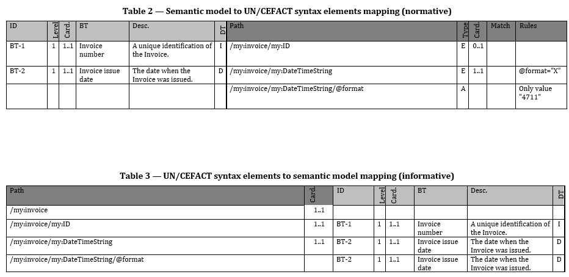
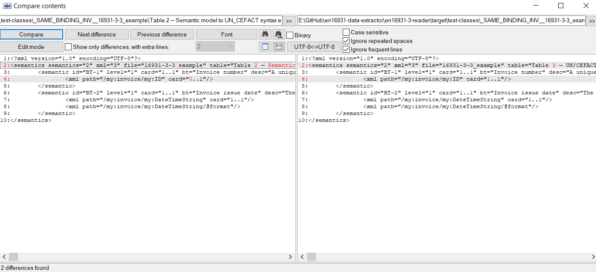

# Data Extractor for the European e-Invoice Specification (en16931)
## Summary
Open sourced for the creators of the EU e-invoice specification to allow easier sanity checks of the data within the tables to improve the quality of the specification.
Build as part of the [PrototypeFund project "paperless"](https://prototypefund.de/project/papierloser-alltag/) to generate larger parts of the software implementing the [European e-invoice specifcation (en16931)](https://invoice.fans/en/en16931-en/).

## Background
### The EU e-Invoice Specification (en16931)
There is [a wonderful online introduction for en16931](https://ec.europa.eu/cefdigital/wiki/display/CEFDIGITAL/Compliance+with+eInvoicing+standard) given by the EU.

### Reason for this Software
The specification EN16931 is meant to build e-invoice software, but it is tedious and error prone to read the manually copy the PDF (or paper) specification.
The goal of this tool is to extract the main data, the so called syntax-binding (mapping) between the XML formats and the Semantic Data Model from more structured office documents. The bindings are for instance required to generate source code for a software allowing to load/save both XML formats. In addition our future software shall modify/create XML by an API based on the Semantic Data Model of en16931.
Some reasoning behind from a developers bird perspective:
 There are three [graphs](https://en.wikipedia.org/wiki/Seven_Bridges_of_K%C3%B6nigsberg) within the EU specification:
1. Graph: Semantic Data Model (describes the user semantic both XML are being mapped upon)
2. Graph: UBL XML - W3C XML grammar (describes all allowed XML files of UBL)
3. Graph: UN/CEFACT CII XML - W3C XML grammar (describes all allowed XML files of UN/CEFACT)

The syntax bindings - this tool is extracting - are contecting "graph 2" with "graph 1" and "graph 2" with "graph 3".
In addition, aside of the grammar there are more restrictions upon the XML that W3C Schema is not able to express ([given by ISO Schematron constraints](https://github.com/CenPC434/validation)), for instance an order date has to be earlier than the pay date.
These schematron restrictions can be seen as additional relations upon the XML grammar graphs (graph 2 & graph 3).
It is planned to map those XML constraints later to the "Semantic Data model" level (graph 1). By this it could be validated if there are constraints only for UBL or UN/CEFACT and missing for the other XML.
Also the same restrictions on the semantic graph might be reused for other older e-invoice formats to be mapped to the Semantic Data Model, in other words the validation artefacts could be easier reused.

## Specification EN16931-3: Details on Syntax Binding
The EU e-invoice specification demands the support of two XML file formats [OASIS UBL 1.2](http://docs.oasis-open.org/ubl/UBL-2.1.html) and [UN/CEFACT XML Industry Invoice D16B](https://www.unece.org/cefact/xml_schemas/index).
In its 3rd, part the EU specification binds the XML syntax to the EU e-invoice semantic. For each syntax exist a document with at least two mapping table.
The first normative table (see "Table 2" below) describe the syntax binding from the semantic (light grey) to XML (dark grey), the second informative table (see Table 3 below) describes it the other way around from XML (dark grey) to semantic (light grey).

The informative table does not add any new information. It starts with the XML part (dark grey), but uses only two of the five XML attributes from the prior normative table.
In theory, the comparison of both tables should provide the same data.

## Software: EN16931 Data Extractor
The data extractor reads the office doucment and the containing mapping tables.
For each table it is splitting:
- The XML part (dark grey)
- The semantic part (light grey)
The extracted data model of each table is saved in its own XML format to ease reading and allow testing the data set.
The new XML structure is straight forward: Just a list of the semantic entities, each containing the corresponding XML elements as their children.

*NOTE:*
To ease comparison of a "normative table" from the specification with it's (hopefully identically) "informative table" twin, which has fewer XML columns, the normative table is being saved twice, once with all information and a second time as a subset equal to the informative table infoset, making file comparison easier.
The name of our own XML files is a combination of: "specification document name" + "table name" + ".xml"

## Software Prerequisites

### Running (everybody, e.g. CEN Technical Writer)
1. [>=JRE 9](https://jdk.java.net/12/)

### Building (developers)
1. [>=JDK 9](https://jdk.java.net/12/)
2. [GIT](https://git-scm.com/)
3. [Apache Maven](https://maven.apache.org/download.cgi?Preferred=ftp://mirror.reverse.net/pub/apache/)

NOTE: There is an [own chapter for software developers about the software](docs/software.md).

## Usage: Extracting the Data
1. Download the JAR with all dependencies includes [en16931-data-extractor-20190821-jar-with-dependencies.jar](docs/en16931-data-extractor-20190821-jar-with-dependencies.jar)
2. To see version information via command-line call: "__java -jar [en16931-data-extractor-20190821-jar-with-dependencies.jar](docs/en16931-data-extractor-20190821-jar-with-dependencies.jar)__"
3. Save the CEN DOCX documents of en16931-3 as ODT (tested with [LibreOffice 6.2.5.2](https://www.libreoffice.org/download/download/))
4. To extract data from the specification via command-line call: "__java -jar [en16931-data-extractor-20190821-jar-with-dependencies.jar](docs/en16931-data-extractor-20190821-jar-with-dependencies.jar) your-specification.odt (or your-directory)__"

## Data Analysis
- The extracted data can be found as XML files aside the input documents.
- Use a text comparing tool like [Total Commander on Windows](https://www.ghisler.com/download.htm) to detect the differences between the ["informative"](docs/resources/16931-3-3_example_informative.xml) and the ["normative SUBSET"](docs/resources/16931-3-3_example_SUBSETnormative.xml) XML files.

